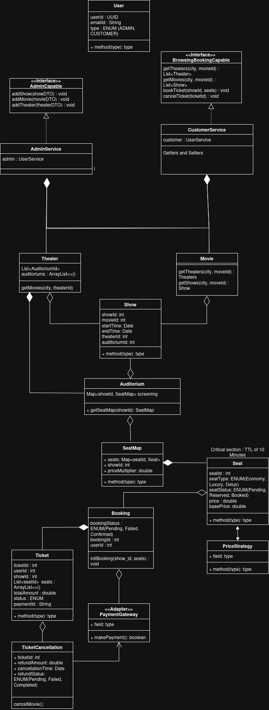

# BookMyShow Design (Java)

**Overview**
- Java implementation of the BookMyShow LLD with admin onboarding, customer browsing, booking, payment, and cancellation flows.
- In-memory data store keeps movies, theaters, shows, seat maps, tickets, bookings, and cancellations for easy experimentation.
- Services are split by responsibility: admin setup vs. customer-facing browse/book/cancel.

**Walkthrough**
1. Admin adds movies, theaters, and shows; each show is seeded with a basic `SeatMap` and seats in `PENDING` state.
2. Customers browse theaters and movies by city, then pick a show.
3. On booking, seats are validated, marked `BOOKED`, priced via `SimplePriceStrategy`, and charged through `MockPaymentGateway` (replaceable via `PaymentGateway`).
4. A confirmed booking creates a `Ticket` and `Booking` entry; failed payments roll seats back to `PENDING`.
5. Cancellations mark seats `PENDING` again and record a `TicketCancellation` with an 80% refund for simplicity.

**Key components**
- `AdminService` implements `AdminCapable` to add movies, theaters, and shows.
- `CustomerService` implements `BrowsingBookingCapable` to browse, book, and cancel tickets, coordinating pricing and payments.
- `InMemoryDataStore` holds domain data and wires theaters to seat maps per auditorium and show.
- `SeatMap`/`Seat` model capacity and pricing; `PriceStrategy` makes pricing pluggable.
- `PaymentGateway`/`MockPaymentGateway` adapt external payments;

**Run the sample**
- Execute `Application` to seed sample data (Inception @ Central Cineplex, Bangalore), book seats, and trigger a cancellation flow.
