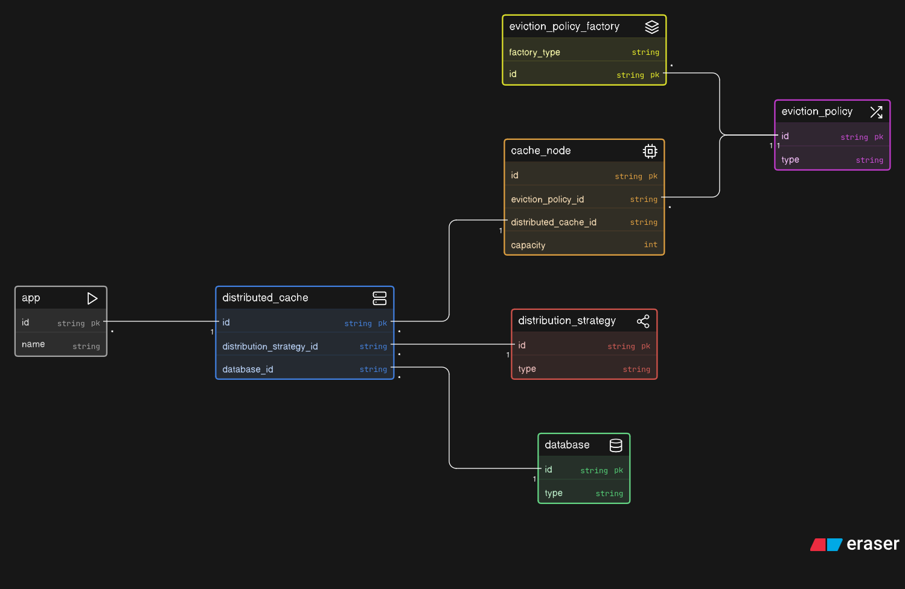

# Distributed Cache (LLD)

This module implements a simple in-memory distributed cache with:
- `get(key)`
- `put(key, value)`

The design supports pluggable:
- Distribution strategy (how keys map to nodes)
- Eviction policy (how each node evicts when full)

Assumption used in this implementation:
- **Write-through** behavior for `put`: database is updated first, then cache.

## UML (Class Diagram)



## How it works

1. Data Distribution
- `DistributedCache` delegates key-to-node mapping to `DistributionStrategy`.
- Included strategies:
  - `ModuloHashDistributionStrategy`: `hash(key) % numberOfNodes`
  - `MapBasedDistributionStrategy`: explicit routing for some keys, fallback strategy for others.

2. Cache Miss Handling (`get`)
- Resolve node via strategy.
- Try `node.get(key)`.
- If not found, read from `Database`.
- If database returns a value, populate the same node and return it.

3. Eviction
- Each `CacheNode` has limited capacity.
- On insert when full, node asks `EvictionPolicy` for candidate key and evicts it.
- Current concrete policy: `LRUEvictionPolicy`.

4. Extensibility
- Add new distribution strategies by implementing `DistributionStrategy` (e.g., consistent hashing).
- Add new eviction policies by implementing `EvictionPolicy` (e.g., LFU, MRU).
- `EvictionPolicyFactory` ensures each node can have isolated policy state.

## Run

From `DistributedCache/`:

```bash
javac -d out $(find src -name "*.java")
java -cp out com.example.DistributedCache.App
```

`App` demonstrates:
- cache miss -> db fetch -> cache fill
- cache hit
- LRU eviction on capacity breach
- write-through behavior for `put`
