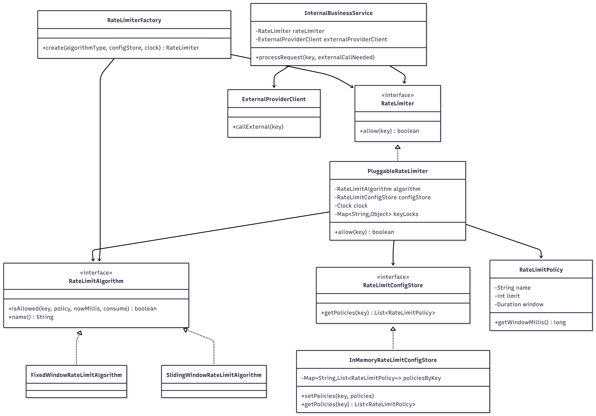

# Pluggable Rate Limiter for External Resource Calls

This module applies rate limiting only when the system is about to call a paid external provider.

## What Is Implemented

- Pluggable strategy-based rate limiting design.
- Two algorithms:
  - Fixed Window Counter
  - Sliding Window Counter (counter approximation, not sliding log)
- Configurable policies per key (customer/tenant/api-key/provider).
- Multiple concurrent limits per key (for example, per-minute + per-hour).
- Thread-safe in-memory implementation.
- Example business flow where rate limiting is skipped if no external call is needed.

## Class Diagram (UML)



## Key Design Decisions

- Rate limiting is invoked at the external-call boundary, not at API ingress.
- Strategy pattern via RateLimitAlgorithm allows adding new algorithms without changing caller/business logic.
- Per-key lock in PluggableRateLimiter ensures multi-policy checks are atomic for a key.
- Algorithm state is isolated by key + policy dimensions.
- Clock is injected for deterministic tests.

## Trade-offs

Fixed Window Counter
- Pros:
  - Very simple and memory efficient.
  - Fast updates and easy reasoning.
- Cons:
  - Boundary burst issue: requests around window edges can exceed ideal smooth rate.

Sliding Window Counter
- Pros:
  - Smoother limiting than fixed window.
  - Reduces edge burst behavior.
- Cons:
  - Uses weighted approximation, not exact event-level precision.
  - Slightly more compute and state complexity than fixed window.

## Switching Algorithms Without Business Logic Changes

Business code depends only on RateLimiter. To switch behavior:

- RateLimiterFactory.create(AlgorithmType.FIXED_WINDOW, ...)
- RateLimiterFactory.create(AlgorithmType.SLIDING_WINDOW, ...)

No change is required in InternalBusinessService.

## Run

From module root:

```bash
javac src/com/example/RateLimiter/*.java
java -cp src com.example.RateLimiter.Application
```

