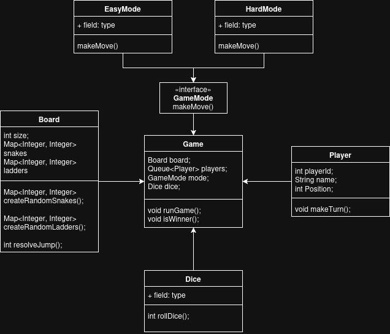

# Snake and Ladder - Design Overview

## UML Diagram

This diagram represents a Snake and Ladder game designed using object-oriented principles.

## Components in the UML

### 1) GameMode (Interface)
- Defines the rule contract for making a move.
- Method: `makeMove()`
- This allows switching behavior without changing the game engine.

### 2) EasyMode
- Implements `GameMode`.
- Rule: If player rolls `6`, player gets an extra turn.
- Calls player movement using dice outcomes.

### 3) HardMode
- Implements `GameMode`.
- Rule: Player can continue on rolling `6`, but if `3` consecutive sixes are rolled, the turn is skipped.
- Otherwise applies all valid rolled steps in that turn.

### 4) Game
- Central orchestrator of the application.
- Holds key objects: board, players, game mode, and dice usage.
- Repeats turns until a winner is found.

### 5) Board
- Represents board size and snake/ladder jumps.
- Maintains:
  - `snakes: Map<Integer, Integer>`
  - `ladders: Map<Integer, Integer>`
- Responsibilities:
  - Random snake creation
  - Random ladder creation
  - Jump resolution (`resolveJump`) when player lands on snake/ladder

### 6) Dice
- Provides random values from `1` to `6`.
- Implemented as Singleton so one shared dice generator is used.

### 7) Player
- Stores player details and current position.
- Fields:
  - `playerId`
  - `name`
  - `position`
- Responsibilities:
  - Move based on dice value (`makeTurn`)
  - Check winning state (`hasWon`)

## Game Flow (Based on UML and Current Design)

1. Start game and take inputs:
   - board size
   - number of players
   - player names
   - mode selection (Easy/Hard)
2. Create `Board`, initialize players, and choose a `GameMode` implementation.
3. Compute winning position as `boardSize * boardSize`.
4. Run turns player by player in sequence:
   - Show board state
   - Roll dice through mode strategy (`GameMode.makeMove`)
   - Update player position
   - Resolve snake/ladder jump using `Board.resolveJump`
   - Check if player reached final position
5. First player to reach the final position wins and game stops.

## Why this Design is Good

- Uses Strategy pattern via `GameMode` for pluggable rules.
- Separates responsibilities clearly (`Board`, `Player`, `Dice`, `Game`).
- Easy to extend with new modes (for example, timed mode, auto mode, custom dice rules).
